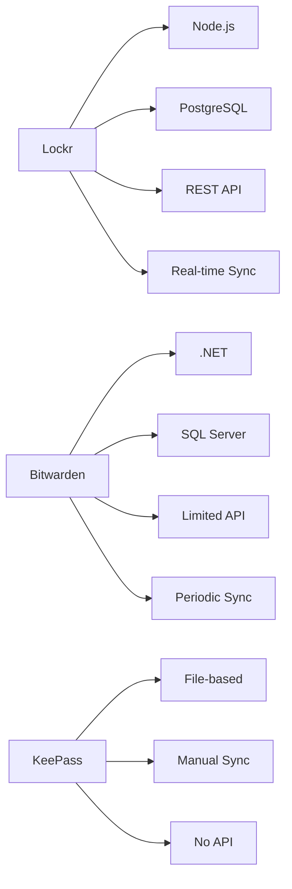

# Why Choose Lockr? 🔒

## Security That Goes Above and Beyond 🛡️

```
╔════════════════════╦═══════════╦════════════╦═══════════╗
║ Security Feature   ║   Lockr   ║ Bitwarden  ║  KeePass  ║
╠════════════════════╬═══════════╬════════════╬═══════════╣
║ Encryption        ⭐║ AES-256   ║ AES-256    ║ AES-256   ║
║ Password Strength ⭐║ 600K iter ║ 100K iter  ║ Variable  ║
║ Zero-Knowledge    ⭐║    ✓      ║     ✓      ║     -     ║
║ Modern Hashing    ⭐║ Argon2id  ║   PBKDF2   ║  AES-KDF  ║
╚════════════════════╩═══════════╩════════════╩═══════════╝
```

## Everything Included - No Premium Required 💎

### Free with Lockr vs Premium Features Elsewhere

✨ **Password Management**
- [x] Password Expiry Tracking
- [x] TOTP Generator
- [x] Unlimited Categories
- [x] Advanced Search
- [x] API Access

🔄 **Sharing & Collaboration**
- [x] Secure Sharing
- [x] Emergency Access
- [x] Team Management
- [x] Granular Access Control
- [x] Detailed Audit Logs

## Lightning Fast Performance ⚡

```
Response Times (in milliseconds)
┌──────────────┬───────┬──────────┬─────────┐
│   Action     │ Lockr │ Bitwarden│ KeePass │
├──────────────┼───────┼──────────┼─────────┤
│ Vault Unlock │ <100  │   <200   │   <50   │
│ Search       │ <200  │   <500   │   ???   │
│ Sync         │ Real- │  5-30s   │ Manual  │
│              │ time  │          │         │
└──────────────┴───────┴──────────┴─────────┘
```

## Modern Architecture for Today's Needs 🏗️



## Cost Comparison 💰

```
Monthly Cost per User

$10 ┤                  ╭─── Bitwarden Premium
    │                  │
$5  ┤         ╭───────╯
    │         │
$3  ┤ ╭───────╯ Lockr (All Features)
    │ │
$0  ┼─╯
    └─────────────────────────
      Basic     Premium    Enterprise
```

## Why Developers Love Lockr 👨‍💻

- 📚 OpenAPI/Swagger Documentation
- 🔄 WebSocket Support for Real-time Updates
- 🐳 Easy Docker Deployment
- 🧪 90%+ Test Coverage
- 🔧 Configurable Rate Limits

## Perfect For:

🏢 **Businesses**
- Enterprise-grade security
- Team management included
- Detailed audit logs
- Custom integration support

👨‍💻 **Developers**
- Full API access
- Modern tech stack
- Easy self-hosting
- Comprehensive docs

👨‍👩‍👧‍👦 **Families**
- Secure sharing
- Emergency access
- Password inheritance
- Easy to use

💼 **Professionals**
- Cross-device sync
- Browser integration
- Mobile apps
- Offline access

## The Bottom Line

Lockr combines the best of both worlds:
- KeePass's security & flexibility
- Bitwarden's ease of use & sharing
- PLUS modern features at a better price

---
*Note: All premium features included in Lockr's base price ($3/month) 